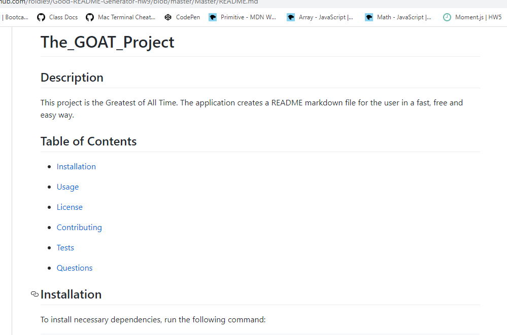
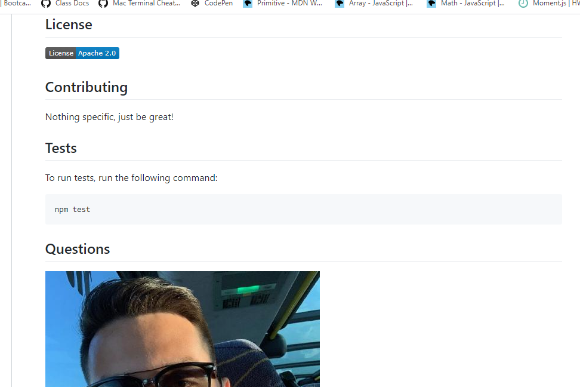

# Good-README-Generator-hw9
---
A command-line application that dynamically generates a README.md from a user's input.

## Usage

Generate program by running "node index.js"

## Screenshot

This is an example of a generated README.md titled "The_GOAT_Project".

## Programs used
JavaScript, GitHub

